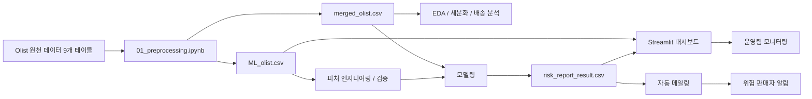
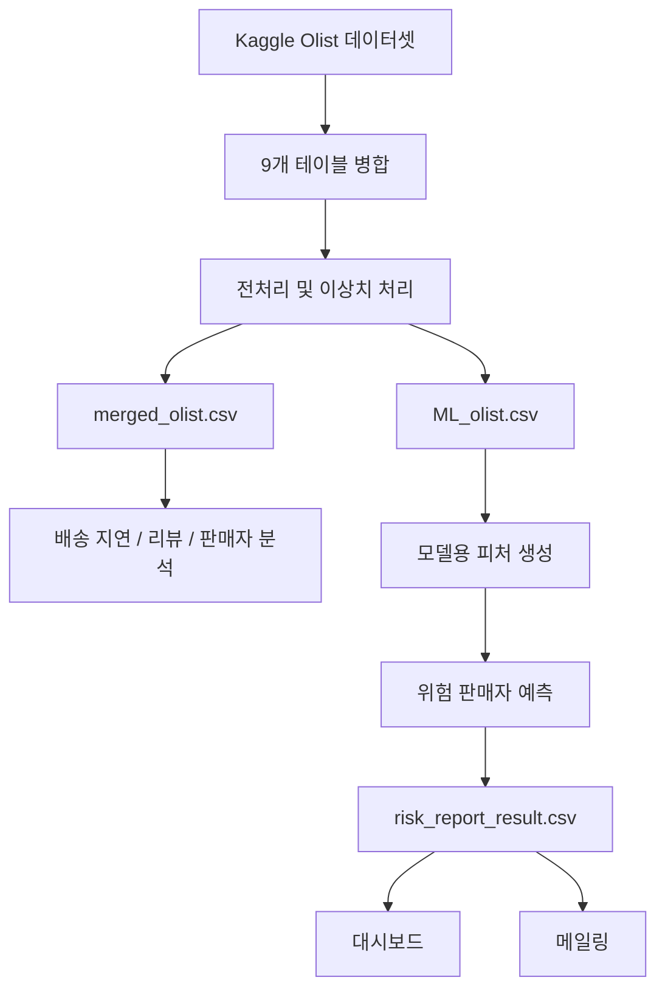

# Olist 유의판매자 조기 탐지 프로젝트

브라질 이커머스 플랫폼 Olist의 주문 데이터를 분석해서  
`배송이 자주 늦고`, `리뷰가 나쁘고`, `운영 관리가 필요한 판매자`를 미리 찾아내는 프로젝트입니다.

이 README는 이 저장소를 처음 보는 사람도 바로 이해할 수 있게 다시 정리한 문서입니다.

## 1. 30초 요약

이 프로젝트는 아래 질문에 답하려고 만들었습니다.

1. 어떤 판매자가 플랫폼 품질을 떨어뜨릴 가능성이 큰가?
2. 그 판매자를 주문이 크게 망가지기 전에 미리 찾을 수 있는가?
3. 찾은 결과를 운영팀이 바로 쓸 수 있는 화면과 메일로 연결할 수 있는가?

이를 위해 아래 흐름을 만들었습니다.

- Kaggle Olist 데이터 9개 테이블을 전처리
- 배송 지연, 리뷰 불만, 판매자 행동을 분석
- 유의판매자(Seller of Note) 기준 정의
- 머신러닝으로 위험 판매자 예측
- 결과를 `risk_report_result.csv`로 저장
- Streamlit 대시보드와 자동 메일링으로 운영 연결

## 2. 이 프로젝트가 해결하려는 문제

쇼핑몰을 운영한다고 생각하면, 모든 판매자가 똑같이 문제를 만드는 것은 아닙니다.

- 어떤 판매자는 출고가 자주 늦고
- 어떤 판매자는 부정 리뷰가 반복되고
- 어떤 판매자는 지금은 괜찮아 보여도 점점 나빠질 수 있습니다

이 프로젝트는 이런 판매자를 뒤늦게 발견하는 대신,  
`문제가 커지기 전에 미리 경고`하는 시스템을 만드는 것이 목표입니다.

쉽게 말하면,

`"나중에 사고 난 뒤 대응하지 말고, 위험한 판매자를 미리 찾자"`  

가 핵심입니다.

## 3. 이 프로젝트에서 말하는 유의판매자란?

이 프로젝트에서 `유의판매자`는 단순히 "판매량이 적은 판매자"가 아니라,

- 판매자 처리 지연이 잦고
- 출고 지연 비율이 높고
- 부정 리뷰 비율이 높은

판매자를 뜻합니다.

즉, 플랫폼 입장에서 계속 지켜봐야 하는 판매자입니다.

## 4. 프로젝트 전체 구조



## 5. 데이터가 어떻게 흘러가는가



## 6. 이 저장소에서 실제로 하는 일

이 저장소는 Olist 프로젝트의 `분석 + 모델링 + 운영 연결`을 담은 원본 작업 저장소입니다.

팀원 정리본 경로는 아래입니다.

`C:\Users\GAZI\Desktop\A_Proj\Olist\Olist-Predictive-Modeling-main`

두 저장소의 차이는 아래처럼 이해하면 됩니다.

- 이 저장소: 실제 작업 과정과 결과 파일이 함께 남아 있는 원본 작업 저장소
- 팀원 정리본: 문서와 발표 흐름을 더 보기 좋게 정리한 참고 버전

즉, 이 저장소는 실제 실행과 결과 확인에 가깝고,  
팀원 정리본은 발표/공유용 구조 참고에 가깝습니다.

## 7. 폴더 구조 설명

```text
Olist_b/
├── archive/
├── assets/
├── data/
├── docs/
├── kwj/
├── notebooks/
├── src/
├── .streamlit/
├── requirements.txt
└── README.md
```

### `data/`

이 프로젝트의 핵심 데이터 파일이 들어 있습니다.

- `merged_olist.csv`
  - 9개 원천 테이블을 합치고 전처리한 통합 데이터
- `ML_olist.csv`
  - 모델링과 대시보드에 맞게 정리한 데이터
- `risk_report_result.csv`
  - 최종 위험 판매자 예측 결과

처음 보는 사람은 이 3개만 기억해도 전체 흐름을 이해할 수 있습니다.

### `notebooks/`

분석 파이프라인이 순서대로 정리돼 있습니다.

- `01_preprocessing.ipynb`
  - 원천 데이터를 합치고 분석용 파일을 만드는 단계
- `02_eda_data_profiling.ipynb`
  - 데이터 구조와 품질 확인
- `03_eda_seller_segmentation.ipynb`
  - 판매자 그룹 나누기
- `04_eda_delivery_analysis.ipynb`
  - 배송 지연 원인 분석
- `05_feature_engineering.ipynb`
  - 모델용 변수 만들기
- `06_feature_validation.ipynb`
  - 변수 검증
- `07_modeling.ipynb`
  - 위험 판매자 예측 모델링
- `08_cost_analysis.ipynb`
  - 비용 영향 분석

즉, `01 -> 08` 순서로 보면 프로젝트 전체 흐름을 따라갈 수 있습니다.

### `src/`

운영에 가까운 Python 코드가 들어 있습니다.

- `src/dashboard.py`
  - Streamlit 대시보드
- `src/generate_risk_data.py`
  - 위험 판매자 예측 결과를 다시 만드는 스크립트
- `src/mailing.py`
  - 위험 판매자 메일링 로직

노트북이 "분석 기록"이라면, `src/`는 "실행용 코드"라고 보면 됩니다.

### `docs/`

분석 결과를 문서로 정리한 폴더입니다.

- `docs/preprocessing_report.md`
- `docs/eda_summary.md`
- `docs/risky_seller_criteria.md`
- `docs/ml_report.md`
- `docs/cost_assumptions.md`

보고서만 먼저 읽고 싶다면 `docs/`부터 보는 것이 좋습니다.

### `assets/`

대시보드에서 쓰는 아이콘 이미지가 들어 있습니다.

### `.streamlit/`

Streamlit 화면 색상, 기본 설정이 들어 있습니다.

### `kwj/`

개인 작업물, 중간 실험 파일, 백업 성격의 자료가 모여 있습니다.  
프로젝트 핵심 실행 흐름은 `notebooks/`, `src/`, `docs/`, `data/` 중심으로 보면 됩니다.

## 8. 핵심 산출물

이 프로젝트의 중요한 결과물은 아래 4가지입니다.

### 1) 분석용 통합 데이터

전처리 결과로 `merged_olist.csv`, `ML_olist.csv`를 만듭니다.

### 2) 유의판매자 예측 결과

모델이 계산한 위험 판매자 결과를 `risk_report_result.csv`로 저장합니다.

### 3) 운영 대시보드

`src/dashboard.py`를 통해 운영팀이 위험 판매자 현황을 바로 볼 수 있게 합니다.

### 4) 자동 메일링 로직

`src/mailing.py`를 통해 위험 등급별로 메일을 보낼 수 있는 구조를 만듭니다.

## 9. 이 프로젝트의 핵심 아이디어

이 프로젝트는 단순히 "평균 배송일"만 보는 것이 아닙니다.

핵심은 아래 3가지를 함께 본다는 점입니다.

- 판매자 처리 지연 비율
- 출고 지연 비율
- 부정 리뷰 비율

그리고 이를 바탕으로 판매자를:

- RED
- ORANGE
- YELLOW
- GREEN

같은 위험 단계로 나눠서 운영팀이 다르게 대응할 수 있게 했습니다.

즉, 분석이 끝이 아니라 `운영 의사결정`까지 연결한 프로젝트입니다.

## 10. 기술 스택

이 프로젝트에서 사용한 주요 기술은 아래와 같습니다.

- Python
- Pandas
- NumPy
- SciPy
- Statsmodels
- Scikit-learn
- XGBoost
- LightGBM
- Matplotlib
- Seaborn
- Plotly
- Streamlit

간단히 말하면,

- `Pandas/NumPy`로 데이터 처리
- `통계 패키지`로 검증
- `머신러닝 모델`로 위험 예측
- `Streamlit`으로 운영 대시보드 구현

구조입니다.

## 11. 실행은 어떻게 하나요?

이 프로젝트는 웹앱 하나만 켜는 구조가 아니라,  
`전처리 -> 분석 -> 모델링 -> 대시보드/메일링` 순서로 보는 프로젝트입니다.

### 11-1. 환경 설치

```bash
pip install -r requirements.txt
```

### 11-2. 데이터 준비

원천 데이터는 아래 Kaggle 링크에서 받을 수 있습니다.

- [Brazilian E-Commerce Public Dataset by Olist](https://www.kaggle.com/datasets/olistbr/brazilian-ecommerce)

실행 전에 최소 아래 파일이 `data/`에 있어야 합니다.

- `merged_olist.csv`
- `ML_olist.csv`

이미 이 저장소에는 분석용 결과 파일이 포함돼 있으므로, 바로 읽기/실행이 가능한 상태입니다.

### 11-3. 대시보드 실행

```bash
streamlit run src/dashboard.py
```

실행 후 브라우저에서 `http://localhost:8501`로 접속합니다.

이 대시보드는:

- 전체 지표 확인
- 날짜/카테고리 필터
- 위험 판매자 확인
- 위험 판매자 데이터 갱신

기능을 제공합니다.

### 11-4. 위험 판매자 결과 재생성

```bash
python src/generate_risk_data.py
```

이 스크립트는 `merged_olist.csv`를 바탕으로  
`risk_report_result.csv`를 다시 만들어 줍니다.

### 11-5. 메일링 기능 사용

메일링은 `src/mailing.py`에 정리돼 있습니다.

실제 메일 발송을 하려면 `.env` 파일에 아래 값이 필요합니다.

```env
GMAIL_USER=your_email@gmail.com
GMAIL_PASSWORD=your_app_password
```

주의:

- Gmail 앱 비밀번호가 필요합니다
- `mailing.py` 내부 스케줄 설정을 실제 운영 환경에 맞게 확인해야 합니다

즉, 메일링은 "바로 실행"보다는 "운영용 연결 코드"로 이해하면 됩니다.

## 12. 처음 보는 사람에게 추천하는 읽는 순서

처음 보는 사람이라면 아래 순서가 가장 이해하기 쉽습니다.

1. 이 README
2. `docs/eda_summary.md`
3. `docs/preprocessing_report.md`
4. `docs/risky_seller_criteria.md`
5. `docs/ml_report.md`
6. `notebooks/01_preprocessing.ipynb`
7. `notebooks/04_eda_delivery_analysis.ipynb`
8. `notebooks/07_modeling.ipynb`
9. `src/dashboard.py`
10. `src/generate_risk_data.py`

## 13. 이 저장소를 한 문장으로 설명하면?

`Olist 주문 데이터를 분석해 위험 판매자를 조기에 탐지하고, 그 결과를 운영 대시보드와 메일링까지 연결한 프로젝트`

라고 설명할 수 있습니다.

## 14. 이 README에서 특히 보강한 점

기존 README는 프로젝트 내용 자체는 좋았지만, 처음 보는 사람이 아래를 이해하기엔 조금 불친절한 부분이 있었습니다.

- 실제 폴더가 무슨 역할을 하는지
- 어떤 파일부터 봐야 하는지
- 어떤 데이터 파일이 핵심인지
- 대시보드와 모델 결과가 어떻게 이어지는지
- 팀원 정리본과 이 저장소의 관계가 무엇인지

그래서 이번 README는 아래를 보강했습니다.

- 쉬운 설명 중심으로 재작성
- Mermaid 아키텍처 다이어그램 추가
- 폴더별 역할 설명
- 데이터 흐름 설명
- 실제 실행 방법 정리
- 읽는 순서 제안
- 팀원 정리본과의 관계 설명

## 15. 데이터 출처

- Kaggle: Brazilian E-Commerce Public Dataset by Olist
- 기간: 2016-09 ~ 2018-08
- 형태: 9개 관계형 테이블 기반 공개 이커머스 데이터

## 16. 마지막 한 줄 요약

이 프로젝트는 Olist 데이터를 이용해  
`문제가 될 판매자를 미리 찾아내고, 그 결과를 분석에서 끝내지 않고 운영 화면과 알림까지 연결한 프로젝트`입니다.
